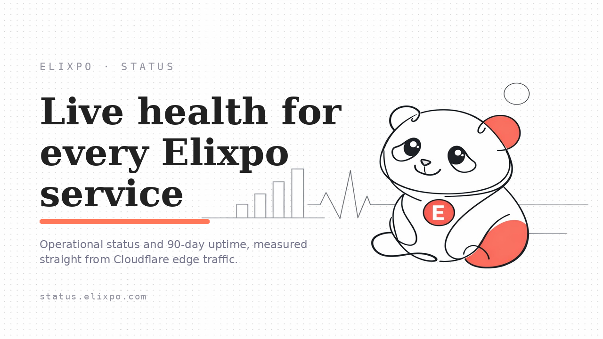
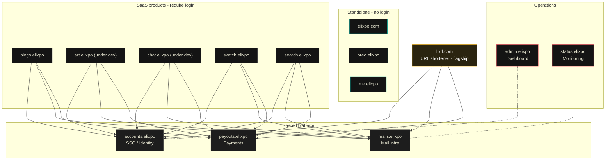

<!--
  ELIXPO README - follows the standard template (STANDARDS.md §4).
  Section order preserved. The "Exclusive" section is None for this repo.
-->

<p align="center">
  
</p>

<h1 align="center">Elixpo Status</h1>

<p align="center">
  <strong>The live health and uptime page for everything Elixpo.</strong><br/>
  Cloudflare-native, free and open source, built by a global community of 45+ contributors.
</p>

<p align="center">
  <a href="https://status.elixpo.com">Status page</a> ·
  <a href="https://elixpo.com">Website</a> ·
  <a href="https://github.com/orgs/elixpo/discussions">Discussions</a> ·
  <a href="https://github.com/elixpo/elixpo_chapter">Monorepo</a> ·
  <a href="https://github.com/sponsors/Circuit-Overtime">Sponsor</a>
</p>

---

## About

**Elixpo Status** is the page you check when you want to know, at a glance,
whether Elixpo's services are working right now → **[status.elixpo.com](https://status.elixpo.com)**.
Think of it like the "Is it down?" board you'd see for any big online product —
green means everything's fine, amber means something's slow, red means something's
broken.

> This repository is the source for the public, Cloudflare-native status and
> uptime page that covers every Elixpo service.

### What it shows you

- **Every Elixpo service in one place** — the main site plus Blogs, Sketch,
  Accounts, Payouts, Mail, Portfolio and more.
- **A simple health label for each one:**
  - 🟢 **Operational** — working normally.
  - 🟠 **Degraded performance** — running, but with some errors or slowness.
  - 🔴 **Outage** — significant problems right now.
  - ⚪ **No traffic** — nobody's using it at the moment, so there's nothing to report.
- **90 days of history** — a bar showing how reliable the platform has been over
  the last three months, so you can see good days and bad days at a glance.
- **Recent changes** — a short list of the latest updates and fixes.

### Where the numbers come from

The status is measured automatically from real visitor traffic at Cloudflare's
network (the layer that sits in front of every Elixpo service). When too many
requests come back as errors, the service is marked as degraded or down. There's
no manual switch to flip and no separate monitoring tool — the page reflects what
real users are actually experiencing.

This means the page is always honest and always up to date: it refreshes on its
own, and a new Elixpo service shows up here as soon as it goes live.

## The ecosystem

| Tool | What it does | Link |
| --- | --- | --- |
| 🎨 **Elixpo Art** | AI image generation _(under dev)_ | [art.elixpo.com](https://elixpo.com) |
| ✍️ **Elixpo Blogs** | A rich, modern writing and publishing space | [blogs.elixpo.com](https://blogs.elixpo.com) |
| 🖊️ **LixSketch** | A hand-drawn style whiteboard for ideas and diagrams | [sketch.elixpo.com](https://sketch.elixpo.com) |
| 💬 **Elixpo Chat** | A fluid, real-time AI chat experience _(under dev)_ | [chat.elixpo.com](https://chat.elixpo.com) |
| 🔎 **Elixpo Search** | Fast, AI-assisted search | [search.elixpo.com](https://search.elixpo.com) |
| 👤 **Elixpo Accounts** | One identity (SSO) across the ecosystem | [accounts.elixpo.com](https://accounts.elixpo.com) |
| 🔗 **lixrl** | Our flagship URL shortener | [lixrl.com](https://lixrl.com) |
| 🪪 **Portfolios** | Personal pages to showcase your work | [me.elixpo.com](https://me.elixpo.com) |
| 🐼 **Oreo** | The mascot's home | [oreo.elixpo.com](https://oreo.elixpo.com) |

Developers can drop our editors into their own projects with the
**`@elixpo/lixsketch`** and **`@elixpo/lixeditor`** packages, on npm and as VS
Code extensions.

## Architecture

Everything runs on **Cloudflare**. Three shared platform services back the
ecosystem, and products are either **SSO-backed SaaS**, **standalone**, or our
**flagship**:

- **`accounts.elixpo`** - single sign-on / identity
- **`mails.elixpo`** - shared mailing infrastructure
- **`payouts.elixpo`** - shared payments / payouts

SaaS products (Blogs, Art, Chat, Sketch, Search) and the flagship **lixrl.com**
all authenticate through Accounts (SSO) and share the Mail and Payouts infra.
The public, login-free surfaces (**elixpo.com**, **oreo.elixpo**, **me.elixpo**)
are standalone. **admin.elixpo** is the operations dashboard and
**status.elixpo** is monitoring.



A rendered, interactive version lives at **[elixpo.com/architecture](https://elixpo.com/architecture)**.

## Built by the community

Elixpo is made by people, in the open. **45+ contributors** have shaped these
tools, with a small core team steering the way:

- **Ayushman Bhattacharya** - Founder & Lead ([@Circuit-Overtime](https://github.com/Circuit-Overtime))
- **Vivek Yadav** - Lead Co-Dev ([@ez-vivek](https://github.com/ez-vivek))
- **Anwesha Chakraborty** - Core Maintainer ([@anwe-ch](https://github.com/anwe-ch))

Everyone is welcome. See **[CONTRIBUTING.md](CONTRIBUTING.md)** and our
**[Code of Conduct](CODE_OF_CONDUCT.md)**.

## Recognition & programs

Elixpo has taken part in and been supported by **GSSOC**, **Hacktoberfest**,
**Pollinations.AI**, **MS Startup Foundations**, and **OSCI**.

## Get involved

- 💬 **Join the conversation** in [GitHub Discussions](https://github.com/orgs/elixpo/discussions).
- 🚀 **Submit your project** to be featured across the ecosystem.
- 🛠️ **Contribute** - browse good first issues in the [monorepo](https://github.com/elixpo/elixpo_chapter).
- ❤️ **Support us** via [GitHub Sponsors](https://github.com/sponsors/Circuit-Overtime).

## Brand assets

Brand-ready marks for this service live under [`public/`](public/) (logo, icons,
and the OG image). The brand source of truth (mascot, palette, rules) and a
browsable kit are at **[elixpo.com/assets](https://elixpo.com/assets)**.

## License

Elixpo uses one **licensing standard** across every repository:

- **Code** - [MIT](LICENSES/preferred/MIT) (with the [Oreo-trademarks exception](LICENSES/exceptions/Oreo-trademarks)).
- **Brand & visual assets** - [CC-BY-4.0](LICENSES/preferred/CC-BY-4.0) (with the same exception).

The Oreo mascot, the chest E-badge, and the "Elixpo" and "Oreo" names, domains,
and palette are reserved - this protects the brand and its royalties while
keeping the code and assets free. See [`LICENSE`](LICENSE) and the per-product
notice board, [`NOTICE`](LICENSES/NOTICE).

## Exclusive

> Per-repo "exclusive" artifacts (an npm package, a VS Code extension, a hosted
> SaaS, a paid tier) are declared here and in [`NOTICE`](LICENSES/NOTICE).

**This repository:** None - it is the source for a hosted status page.

---

## Running this locally

```bash
npm install
npm run dev
```

Then open [http://localhost:3000](http://localhost:3000).

For deploys: this is built with Next.js and deployed on Cloudflare Pages — see
`wrangler.toml` for the deploy config and run `npm run pages:deploy` to publish.

<p align="center">
  <sub>Made in the open, together. © 2023-2026 Elixpo.</sub>
</p>
